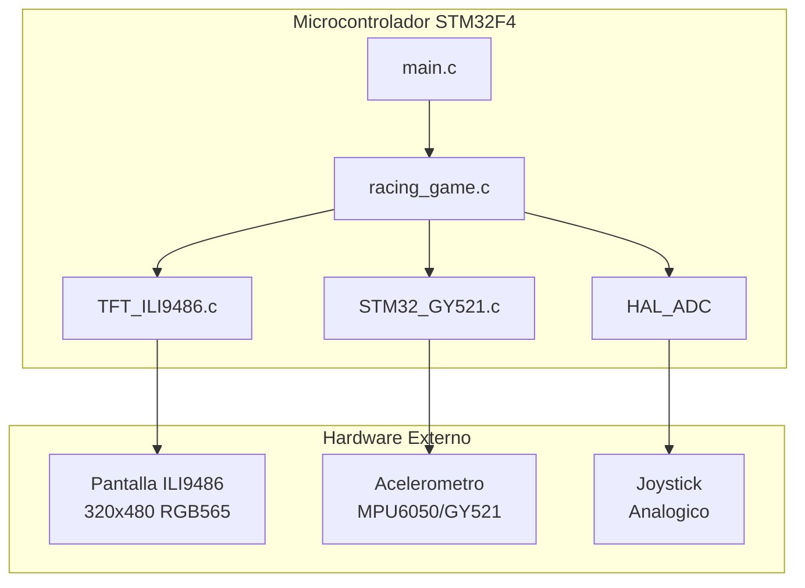
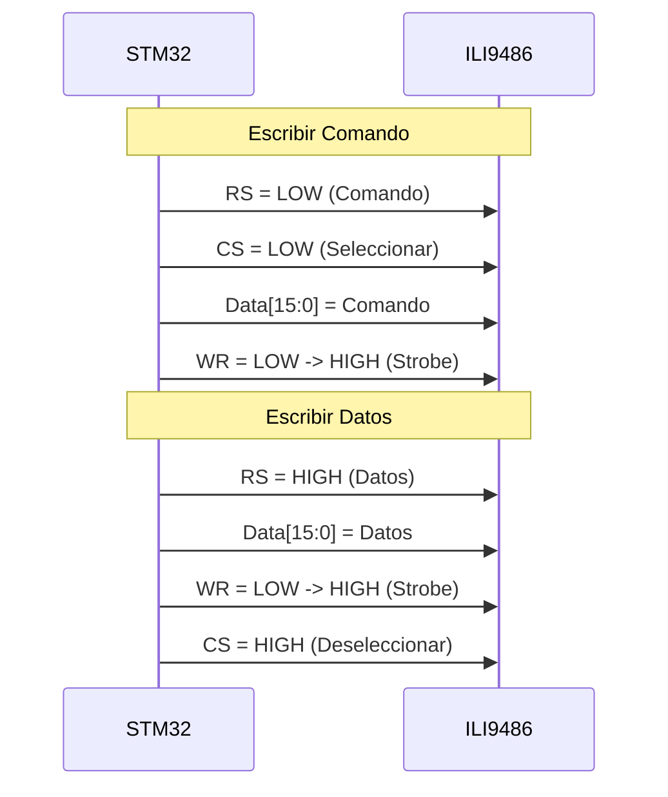
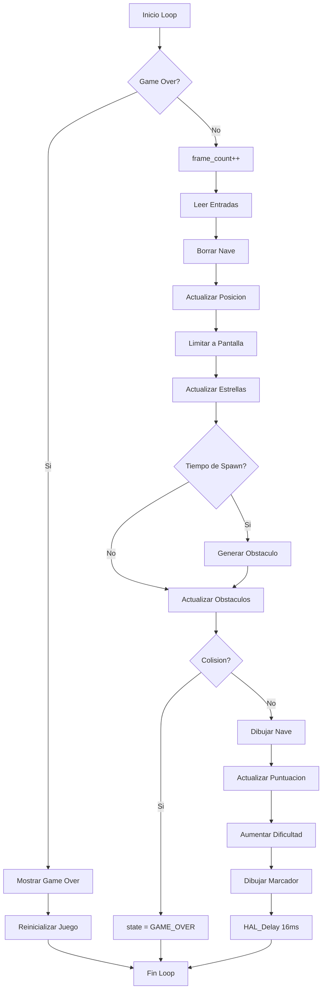
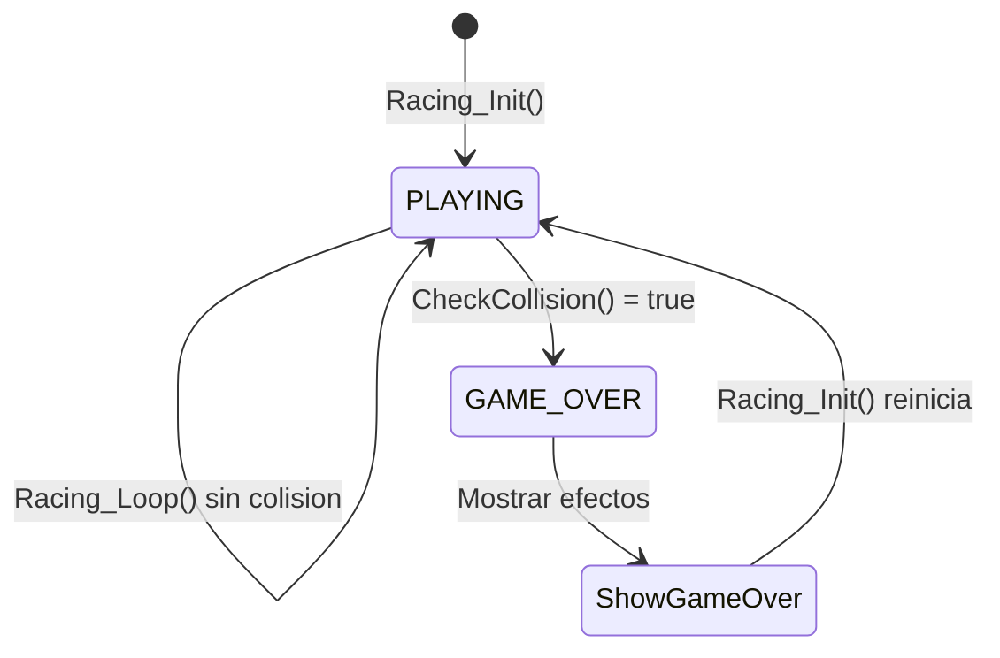
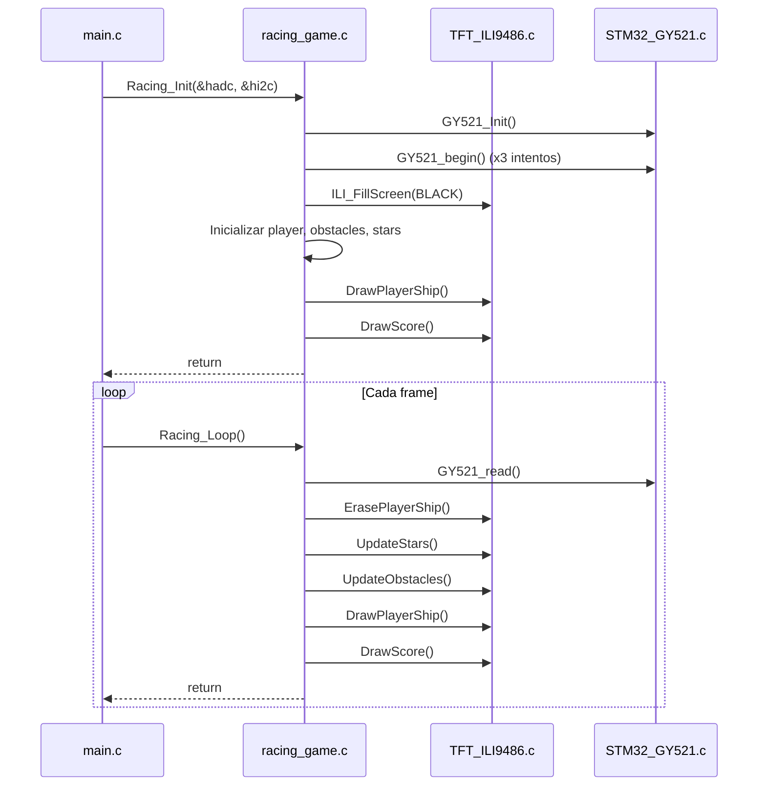

# Documentacion Tecnica Completa: Space Racing Game

> **Archivo Principal:** `racing_game.c` | **Header:** `racing_game.h`  
> **Plataforma:** STM32F4xx | **Pantalla:** ILI9486 (320x480 RGB565)

---

## Indice

1. [Vision General del Sistema](#1-vision-general-del-sistema)
2. [Arquitectura de Hardware](#2-arquitectura-de-hardware)
3. [Estructuras de Datos](#3-estructuras-de-datos)
4. [Sistema de Renderizado Pantalla](#4-sistema-de-renderizado-pantalla)
5. [Sistema de Entrada Controles](#5-sistema-de-entrada-controles)
6. [Logica del Juego](#6-logica-del-juego)
7. [Algoritmos Clave](#7-algoritmos-clave)
8. [Flujo de Ejecucion](#8-flujo-de-ejecucion)
9. [Constantes y Configuracion](#9-constantes-y-configuracion)
10. [Optimizaciones Implementadas](#10-optimizaciones-implementadas)

---

## 1. Vision General del Sistema

### Que es Space Racing Game?

Es un juego de **scroll vertical** estilo **Galaga/Space Invaders** implementado completamente en un microcontrolador **STM32F4** con una pantalla TFT ILI9486 de 320x480 pixeles.

### Caracteristicas Principales

| Caracteristica | Descripcion |
|----------------|-------------|
| **Genero** | Juego de esquivar obstaculos con scroll vertical |
| **Control Horizontal** | Acelerometro GY521 (I2C) - Inclinacion del dispositivo |
| **Control Vertical** | Joystick analogico (ADC) - Movimiento arriba/abajo |
| **Resolucion** | 320x480 pixeles en modo portrait |
| **Colores** | RGB565 (16 bits = 65,536 colores) |
| **Frame Rate Objetivo** | ~60 FPS (delay de 16ms por frame) |

### Diagrama de Componentes



---

## 2. Arquitectura de Hardware

### 2.1 Pantalla ILI9486

La pantalla utiliza una **interfaz paralela de 16 bits** para maxima velocidad de transferencia.

#### Conexion de Pines de Control

| Pin | Puerto | Funcion | Descripcion |
|-----|--------|---------|-------------|
| **RS** | PB14 | Register Select | `LOW` = Comando, `HIGH` = Datos |
| **WR** | PB1 | Write Strobe | Flanco de bajada escribe datos |
| **CS** | PBx | Chip Select | `LOW` = Pantalla activa |
| **RST** | PBx | Reset | Reinicio por hardware |

#### Bus de Datos de 16 bits

```
Bit  | Pin   | Puerto
-----|-------|-------
DB0  | PB13  | GPIOB
DB1  | PC4   | GPIOC
DB2  | PA10  | GPIOA
DB3  | PB5   | GPIOB
DB4  | PB10  | GPIOB
DB5  | PA8   | GPIOA
DB6  | PA9   | GPIOA
DB7  | PC7   | GPIOC
DB8  | PC5   | GPIOC
DB9  | PC6   | GPIOC
DB10 | PC8   | GPIOC
DB11 | PC9   | GPIOC
DB12 | PA5   | GPIOA
DB13 | PA6   | GPIOA
DB14 | PA7   | GPIOA
DB15 | PB6   | GPIOB
```

### 2.2 Acelerometro GY521 (MPU6050)

| Parametro | Valor |
|-----------|-------|
| **Protocolo** | I2C |
| **Direccion** | 0x69 |
| **Eje Usado** | `ay` (aceleracion en Y) |
| **Rango** | ±1g (valores flotantes) |
| **Uso** | Control horizontal de la nave |

### 2.3 Joystick Analogico

| Parametro | Valor |
|-----------|-------|
| **Protocolo** | ADC (12 bits) |
| **Rango** | 0-4095 |
| **Centro** | ~2048 |
| **Uso** | Control vertical de la nave |

---

## 3. Estructuras de Datos

### 3.1 RacingPlayerShip (Nave del Jugador)

```c
typedef struct {
    int16_t x;    // Posicion horizontal (centro de la nave)
    int16_t y;    // Posicion vertical (centro de la nave)
} RacingPlayerShip;
```

**Dimensiones de la nave:**

- Ancho: 24 pixeles (`SHIP_WIDTH`)
- Alto: 20 pixeles (`SHIP_HEIGHT`)
- Sprite va desde `x-11` hasta `x+11` horizontalmente
- Sprite va desde `y-10` hasta `y+6` verticalmente

### 3.2 RacingObstacle (Enemigos/Obstaculos)

```c
typedef enum {
    RACING_OBS_ENEMY_BEE = 0,      // Amarillo/Naranja
    RACING_OBS_ENEMY_BUTTERFLY,     // Azul/Cyan
    RACING_OBS_ENEMY_BOSS,          // Rojo/Magenta
    RACING_OBS_ASTEROID             // Gris
} RacingObstacleType;

typedef struct {
    int16_t x;              // Posicion X del obstaculo
    int16_t y;              // Posicion Y del obstaculo
    RacingObstacleType type; // Tipo (determina colores)
    uint8_t active;         // 1 = activo, 0 = inactivo
    int8_t speed;           // Velocidad de caida (pixeles/frame)
} RacingObstacle;
```

**Limites:** `RACING_MAX_OBSTACLES = 8` obstaculos simultaneos

### 3.3 RacingStar (Estrellas del Fondo)

```c
typedef struct {
    int16_t x;          // Posicion horizontal
    int16_t y;          // Posicion vertical
    uint8_t brightness; // 0 = tenue, 1 = media, 2 = brillante
} RacingStar;
```

**Limites:** `RACING_MAX_STARS = 30` estrellas

El brillo afecta:

1. **Velocidad de movimiento:** `1 + brightness` pixeles/frame
2. **Tamaño visual:** `1 + brightness/2` pixeles de ancho
3. **Color:** Desde `RACING_COL_STAR_DIM` hasta `RACING_COL_STAR_BRIGHT`

### 3.4 RacingGame (Estado Global del Juego)

```c
typedef enum {
    RACING_GAME_PLAYING = 0,  // Jugando activamente
    RACING_GAME_OVER,         // Game Over
    RACING_GAME_PAUSED        // Pausado (no implementado)
} RacingGameStateEnum;

typedef struct {
    uint32_t score;           // Puntuacion actual
    uint32_t hi_score;        // Puntuacion mas alta
    uint8_t speed;            // Velocidad base de obstaculos
    RacingGameStateEnum state; // Estado del juego
    uint32_t frame_count;     // Contador de frames
    uint32_t next_spawn_frame; // Frame para generar siguiente obstaculo
} RacingGame;
```

---

## 4. Sistema de Renderizado Pantalla

### 4.1 Formato de Color RGB565

La pantalla usa colores de **16 bits** en formato RGB565:

```
Bits:  15-11  |  10-5  |  4-0
       R(5)   |  G(6)  |  B(5)
```

**Ejemplos de colores definidos:**

| Color | Valor Hex | Bits R-G-B |
|-------|-----------|------------|
| `COL_BLACK` | `0x0000` | 00000-000000-00000 |
| `COL_WHITE` | `0xFFFF` | 11111-111111-11111 |
| `COL_RED` | `0xF800` | 11111-000000-00000 |
| `COL_GREEN` | `0x07E0` | 00000-111111-00000 |
| `COL_BLUE` | `0x001F` | 00000-000000-11111 |
| `COL_YELLOW` | `0xFFE0` | 11111-111111-00000 |
| `COL_CYAN` | `0x07FF` | 00000-111111-11111 |

### 4.2 Funcion Critica: ILI_FillRect()

Esta es la funcion **mas importante** para el rendimiento del juego.

```c
void ILI_FillRect(int x, int y, int w, int h, uint16_t color);
```

#### Funcionamiento Paso a Paso

1. **Validacion de limites:**

   ```c
   if ((x >= ILI9486_SCREEN_WIDTH) || (y >= ILI9486_SCREEN_HEIGHT)) return;
   if ((x + w - 1) >= ILI9486_SCREEN_WIDTH) w = ILI9486_SCREEN_WIDTH - x;
   if ((y + h - 1) >= ILI9486_SCREEN_HEIGHT) h = ILI9486_SCREEN_HEIGHT - y;
   ```

2. **Establecer ventana de direccion:**

   ```c
   ILI_SetAddressWindow(x, y, x + w - 1, y + h - 1);
   ```

   Esto le dice a la pantalla: "los proximos datos van en este rectangulo"

3. **Pre-calcular valores BSRR:**
   En lugar de calcular los bits de GPIO para cada pixel, se calculan una sola vez:

   ```c
   uint32_t pa_bsrr = (pa_reset << 16) | pa_set; // Para GPIOA
   uint32_t pb_bsrr = (pb_reset << 16) | pb_set; // Para GPIOB
   uint32_t pc_bsrr = (pc_reset << 16) | pc_set; // Para GPIOC
   ```

4. **Escribir pixeles con loop unrolling:**

   ```c
   for (uint32_t i = 0; i < loops; i++) {
       // Se repite 16 veces por iteracion
       GPIOB->BSRR = wr_lo;  // WR bajo
       __NOP(); __NOP();      // Espera minima
       GPIOB->BSRR = wr_hi;  // WR alto
       __NOP(); __NOP();
       // ... 15 veces mas
   }
   ```

### 4.3 Protocolo de Escritura a la Pantalla



### 4.4 Sprites del Juego

#### Nave del Jugador

La nave se dibuja con multiples rectangulos coloreados:

```c
static void DrawPlayerShip(int16_t cx, int16_t cy, uint8_t erase) {
    uint16_t white = erase ? COL_BLACK : COL_WHITE;
    uint16_t red = erase ? COL_BLACK : COL_RED;
    uint16_t blue = erase ? COL_BLACK : COL_BLUE;
    
    // Torre central (spike superior)
    ILI_FillRect(cx - 1, cy - 10, 3, 4, white);
    
    // Cuerpo principal superior
    ILI_FillRect(cx - 3, cy - 6, 7, 3, white);
    
    // Cabina (centro rojo)
    ILI_FillRect(cx - 1, cy - 4, 3, 2, red);
    
    // ... mas componentes
}
```

**Estructura visual de la nave:**

```
        ##          <- Torre central (blanco)
       ####         <- Cuerpo superior (blanco)
       %%%          <- Cabina (rojo)
     ##########     <- Cuerpo medio (blanco)
    ##  %%  ##      <- Acentos azules
######        ###### <- Alas extendidas
####            #### <- Puntas de alas
 %%              %%  <- Acentos rojos en alas
```

#### Obstaculos/Enemigos

```c
static void DrawObstacle(RacingObstacle *o, uint8_t erase) {
    uint16_t color1, color2;
    
    switch (o->type) {
        case RACING_OBS_ENEMY_BEE:      // Abeja
            color1 = COL_YELLOW;
            color2 = COL_ORANGE;
            break;
        case RACING_OBS_ENEMY_BUTTERFLY: // Mariposa
            color1 = COL_BLUE;
            color2 = COL_CYAN;
            break;
        case RACING_OBS_ENEMY_BOSS:      // Jefe
            color1 = COL_RED;
            color2 = COL_MAGENTA;
            break;
        case RACING_OBS_ASTEROID:        // Asteroide
            color1 = COL_GRAY;
            color2 = COL_DARKGRAY;
            break;
    }
    
    // Cuerpo del enemigo
    ILI_FillRect(x - 4, y - 3, 9, 6, color1);
    
    // Alas/antenas
    ILI_FillRect(x - 7, y - 1, 3, 4, color2);
    ILI_FillRect(x + 5, y - 1, 3, 4, color2);
    
    // Ojos (solo si no estamos borrando)
    if (!erase) {
        ILI_FillRect(x - 2, y - 2, 2, 2, COL_WHITE);
        ILI_FillRect(x + 1, y - 2, 2, 2, COL_WHITE);
    }
}
```

---

## 5. Sistema de Entrada Controles

### 5.1 Lectura del Acelerometro (Movimiento Horizontal)

```c
static int8_t ReadAccelInput(void) {
    if (hi2c_accel == NULL || !gy521_ok)
        return 0;
    
    // 1. Leer sensor GY521
    GY521_read(&gy521_sensor);
    
    // 2. Obtener aceleracion en eje Y (en g's, -1.0 a +1.0)
    float accel_val = gy521_sensor.ay;
    
    // 3. Aplicar zona muerta (deadzone)
    float deadzone_g = (float)RACING_ACCEL_DEADZONE / (float)RACING_ACCEL_MAX;
    if (accel_val > -deadzone_g && accel_val < deadzone_g) {
        return 0;  // Sin movimiento si esta dentro de la zona muerta
    }
    
    // 4. Mapear a velocidad de movimiento
    int32_t speed = (int32_t)(accel_val * SHIP_SPEED_X * 2.0f);
    
    // 5. Limitar velocidad maxima
    if (speed > SHIP_SPEED_X) speed = SHIP_SPEED_X;
    if (speed < -SHIP_SPEED_X) speed = -SHIP_SPEED_X;
    
    // 6. Invertir para coincidir con orientacion
    return (int8_t)(-speed);
}
```

**Diagrama de Zona Muerta:**

```
          <-  IZQUIERDA  |  ZONA MUERTA  |  DERECHA  ->
           -1g    -0.17g  -deadzone  +deadzone  +0.17g    +1g
    -----------------------|   SIN   |------------------------
    <- Velocidad -4 a -1 -> | MOV = 0 | <- Velocidad +1 a +4 ->
```

### 5.2 Lectura del Joystick (Movimiento Vertical)

```c
static int8_t ReadJoystickY(void) {
    if (hadc_joystick == NULL)
        return 0;
    
    // 1. Leer ADC directamente (polling)
    HAL_ADC_Start(hadc_joystick);
    HAL_ADC_PollForConversion(hadc_joystick, 10);
    uint32_t adc_raw = HAL_ADC_GetValue(hadc_joystick);
    
    // 2. Centrar el valor (2048 es el centro en ADC de 12 bits)
    int16_t adc_y = (int16_t)adc_raw - RACING_ADC_CENTER;
    
    // 3. Aplicar zona muerta
    if (adc_y > -RACING_ADC_DEADZONE && adc_y < RACING_ADC_DEADZONE) {
        return 0;
    }
    
    // 4. Mapear a velocidad
    int32_t speed = (adc_y * SHIP_SPEED_Y) / (2048 - RACING_ADC_DEADZONE);
    
    // 5. Limitar
    if (speed > SHIP_SPEED_Y) speed = SHIP_SPEED_Y;
    if (speed < -SHIP_SPEED_Y) speed = -SHIP_SPEED_Y;
    
    return (int8_t)(-speed);
}
```

**Mapeo del ADC:**

```
ADC Crudo:    0 ------- 2048 ------- 4095
                         |
              RACING_ADC_CENTER
                         
Centrado:  -2048 ------- 0 ------- +2047
              |     DEADZONE      |
           ABAJO        |        ARRIBA
              |    (-400,+400)    |
            
Velocidad:   -3 ------ 0 ------ +3
```

---

## 6. Logica del Juego

### 6.1 Inicializacion del Juego

```c
void Racing_Init(ADC_HandleTypeDef *hadc, I2C_HandleTypeDef *hi2c) {
    // 1. Guardar handles de perifericos
    hadc_joystick = hadc;
    hi2c_accel = hi2c;
    
    // 2. Inicializar sensor GY521
    GY521_Init(&gy521_sensor, hi2c_accel, 0x69);
    gy521_ok = 0;
    for (int i = 0; i < 3; i++) {
        if (GY521_begin(&gy521_sensor) == true) {
            gy521_ok = 1;
            break;
        }
    }
    
    // 3. Limpiar pantalla
    ILI_FillScreen(COL_BLACK);
    
    // 4. Inicializar jugador
    player.x = SHIP_START_X;  // Centro horizontal
    player.y = SHIP_START_Y;  // Parte inferior
    
    // 5. Desactivar todos los obstaculos
    for (int i = 0; i < RACING_MAX_OBSTACLES; i++) {
        obstacles[i].active = 0;
    }
    
    // 6. Estado inicial del juego
    game.score = 0;
    game.speed = OBSTACLE_BASE_SPEED;
    game.state = RACING_GAME_PLAYING;
    game.frame_count = 0;
    game.next_spawn_frame = 30;
    
    // 7. Semilla aleatoria basada en tiempo
    rand_seed = HAL_GetTick();
    
    // 8. Inicializar estrellas y dibujar estado inicial
    InitStars();
    DrawPlayerShip(player.x, player.y, 0);
    DrawScore();
    
    HAL_Delay(300);
}
```

### 6.2 Bucle Principal del Juego

```c
void Racing_Loop(void) {
    // 1. Verificar game over
    if (game.state == RACING_GAME_OVER) {
        ShowGameOver();
        Racing_Init(hadc_joystick, hi2c_accel);
        return;
    }
    
    game.frame_count++;
    
    // 2. Leer entradas
    int8_t move_x = ReadAccelInput();
    int8_t move_y = ReadJoystickY();
    
    // 3. Borrar nave anterior
    ErasePlayerShip(player.x, player.y);
    
    // 4. Actualizar posicion del jugador
    player.x += move_x;
    player.y += move_y;
    
    // 5. Mantener dentro de limites
    if (player.x < SHIP_MIN_X) player.x = SHIP_MIN_X;
    if (player.x > SHIP_MAX_X) player.x = SHIP_MAX_X;
    if (player.y < SHIP_MIN_Y) player.y = SHIP_MIN_Y;
    if (player.y > SHIP_MAX_Y) player.y = SHIP_MAX_Y;
    
    // 6. Actualizar fondo de estrellas
    UpdateStars();
    
    // 7. Generar nuevos obstaculos si es el momento
    if (game.frame_count >= game.next_spawn_frame) {
        SpawnObstacle();
    }
    
    // 8. Actualizar obstaculos existentes
    UpdateObstacles();
    
    // 9. Verificar colisiones
    if (CheckCollision()) {
        game.state = RACING_GAME_OVER;
        if (game.score > game.hi_score) {
            game.hi_score = game.score;
        }
        return;
    }
    
    // 10. Dibujar nave en nueva posicion
    DrawPlayerShip(player.x, player.y, 0);
    
    // 11. Incrementar puntuacion cada 5 frames
    if (game.frame_count % 5 == 0) {
        game.score++;
    }
    
    // 12. Aumentar dificultad cada 200 puntos
    if (game.score % RACING_SPEED_INCREMENT_SCORE == 0 && game.score > 0) {
        if (game.speed < OBSTACLE_MAX_SPEED) {
            game.speed++;
        }
    }
    
    // 13. Actualizar marcador cada 10 frames
    if (game.frame_count % 10 == 0) {
        DrawScore();
    }
    
    // 14. Mantener ~60 FPS
    HAL_Delay(RACING_GAME_DELAY);  // 16ms
}
```

### 6.3 Flujo del Game Loop



---

## 7. Algoritmos Clave

### 7.1 Generador de Numeros Aleatorios (PRNG)

```c
static uint32_t rand_seed = 12345;

static uint32_t simple_rand(void) {
    rand_seed = rand_seed * 1103515245 + 12345;
    return (rand_seed >> 16) & 0x7FFF;
}
```

**Explicacion:**

- Es un **Linear Congruential Generator (LCG)**
- Formula: `seed = seed * a + c`
- Constantes `a=1103515245` y `c=12345` son las del estandar POSIX
- Retorna los bits 16-30 (15 bits = 0-32767) para mejor distribucion
- La semilla se inicializa con `HAL_GetTick()` para pseudo-aleatoriedad

### 7.2 Efecto Parallax de Estrellas

```c
static void UpdateStars(void) {
    for (int i = 0; i < RACING_MAX_STARS; i++) {
        // Borrar posicion anterior
        ILI_FillRect(stars[i].x, stars[i].y, 2, 2, COL_BLACK);
        
        // Velocidad basada en brillo (efecto parallax)
        // Estrellas brillantes = mas rapidas = mas "cerca"
        stars[i].y += 1 + stars[i].brightness;
        
        // Regresar al tope si sale de pantalla
        if (stars[i].y >= SCREEN_HEIGHT) {
            stars[i].y = 0;
            stars[i].x = simple_rand() % SCREEN_WIDTH;
        }
        
        // Dibujar en nueva posicion
        uint16_t color;
        switch (stars[i].brightness) {
            case 0: color = RACING_COL_STAR_DIM; break;
            case 1: color = RACING_COL_STAR_MED; break;
            default: color = RACING_COL_STAR_BRIGHT; break;
        }
        ILI_FillRect(stars[i].x, stars[i].y, 
                     1 + stars[i].brightness / 2, 1, color);
    }
}
```

**Efecto Visual:**

```
SIMULACION DE PROFUNDIDAD

Capa Lejana (brightness=0):
  - Velocidad: 1 px/frame
  - Color: Gris oscuro
  - Tamano: 1 px

Capa Media (brightness=1):
  - Velocidad: 2 px/frame
  - Color: Gris medio
  - Tamano: 1 px

Capa Cercana (brightness=2):
  - Velocidad: 3 px/frame
  - Color: Blanco
  - Tamano: 2 px
```

### 7.3 Sistema de Spawn de Obstaculos

```c
static void SpawnObstacle(void) {
    // Buscar slot libre
    for (int i = 0; i < RACING_MAX_OBSTACLES; i++) {
        if (!obstacles[i].active) {
            obstacles[i].active = 1;
            
            // Posicion X aleatoria (con margen de 20px)
            obstacles[i].x = 20 + (simple_rand() % (SCREEN_WIDTH - 40));
            
            // Aparecer arriba de la pantalla
            obstacles[i].y = -20;
            
            // Velocidad = base + variacion aleatoria
            obstacles[i].speed = game.speed + (simple_rand() % 3);
            
            // Tipo aleatorio con probabilidades:
            // 30% Bee, 30% Butterfly, 20% Asteroid, 20% Boss
            uint32_t r = simple_rand() % 10;
            if (r < 3) obstacles[i].type = RACING_OBS_ENEMY_BEE;
            else if (r < 6) obstacles[i].type = RACING_OBS_ENEMY_BUTTERFLY;
            else if (r < 8) obstacles[i].type = RACING_OBS_ASTEROID;
            else obstacles[i].type = RACING_OBS_ENEMY_BOSS;
            
            // Programar siguiente spawn
            game.next_spawn_frame = game.frame_count + 
                RACING_SPAWN_INTERVAL_MIN +
                (simple_rand() % (RACING_SPAWN_INTERVAL_MAX - 
                                  RACING_SPAWN_INTERVAL_MIN));
            return;
        }
    }
}
```

**Intervalo de Spawn:**

- Minimo: 20 frames (~0.33 segundos)
- Maximo: 60 frames (~1 segundo)
- Aleatorio dentro de ese rango

### 7.4 Deteccion de Colisiones (AABB)

```c
static uint8_t CheckCollision(void) {
    for (int i = 0; i < RACING_MAX_OBSTACLES; i++) {
        if (!obstacles[i].active) continue;
        
        int16_t px = player.x, py = player.y;
        int16_t ox = obstacles[i].x, oy = obstacles[i].y;
        
        // Colision AABB con hitbox reducido para ser "justo"
        if (ox >= px - 10 && ox <= px + 10 &&
            oy >= py - 10 && oy <= py + 12) {
            return 1;  // Colision!
        }
    }
    return 0;  // Sin colision
}
```

**Visualizacion del Hitbox:**

```
Nave Real: 24x17 pixeles
           +------------------------+
           |                        |
         +-+------------------------+-+
         | |     SPRITE NAVE        | |
         | |                        | |
         +-+------------------------+-+
           |                        |
           +------------------------+

Hitbox Colision: 20x22 pixeles (mas pequeno)
              +----------------------+
              |   +--------------+   |
              |   |   HITBOX     |   |
              |   |    REAL      |   |
              |   +--------------+   |
              +----------------------+
              
El hitbox es mas pequeno para dar al jugador
un margen de error visual.
```

### 7.5 Dibujo de Digitos (Marcador)

```c
static void DrawDigit(int16_t x, int16_t y, uint8_t digit, uint16_t color) {
    // Matriz de segmentos estilo display de 7 segmentos
    const uint8_t digits[10][7] = {
        //  A  B  C  D  E  F  G  (segmentos)
        {1, 1, 1, 0, 1, 1, 1}, // 0
        {0, 0, 1, 0, 0, 1, 0}, // 1
        {1, 0, 1, 1, 1, 0, 1}, // 2
        // ... etc
    };
    
    // Dibujar cada segmento activo
    if (digits[digit][0]) ILI_FillRect(x + 1, y, 3, 1, color);     // A (arriba)
    if (digits[digit][1]) ILI_FillRect(x, y + 1, 1, 2, color);     // B (izq-arr)
    if (digits[digit][2]) ILI_FillRect(x + 4, y + 1, 1, 2, color); // C (der-arr)
    if (digits[digit][3]) ILI_FillRect(x + 1, y + 3, 3, 1, color); // D (medio)
    if (digits[digit][4]) ILI_FillRect(x, y + 4, 1, 2, color);     // E (izq-abj)
    if (digits[digit][5]) ILI_FillRect(x + 4, y + 4, 1, 2, color); // F (der-abj)
    if (digits[digit][6]) ILI_FillRect(x + 1, y + 6, 3, 1, color); // G (abajo)
}
```

**Mapa de Segmentos:**

```
    -A-
   |   |
   B   C
   |   |
    -D-
   |   |
   E   F
   |   |
    -G-
```

---

## 8. Flujo de Ejecucion

### 8.1 Diagrama de Estados del Juego



### 8.2 Secuencia de Inicializacion



---

## 9. Constantes y Configuracion

### 9.1 Tabla Completa de Constantes

| Constante | Valor | Descripcion |
|-----------|-------|-------------|
| `SCREEN_WIDTH` | 320 | Ancho de pantalla en pixeles |
| `SCREEN_HEIGHT` | 480 | Alto de pantalla en pixeles |
| `SHIP_WIDTH` | 24 | Ancho del sprite de la nave |
| `SHIP_HEIGHT` | 20 | Alto del sprite de la nave |
| `SHIP_START_X` | 160 | Posicion X inicial (centro) |
| `SHIP_START_Y` | 420 | Posicion Y inicial (abajo) |
| `SHIP_MIN_Y` | 100 | Limite superior del jugador |
| `SHIP_MAX_Y` | 450 | Limite inferior del jugador |
| `SHIP_MIN_X` | 15 | Limite izquierdo del jugador |
| `SHIP_MAX_X` | 305 | Limite derecho del jugador |
| `SHIP_SPEED_X` | 4 | Velocidad horizontal maxima (px/frame) |
| `SHIP_SPEED_Y` | 3 | Velocidad vertical maxima (px/frame) |
| `RACING_MAX_OBSTACLES` | 8 | Maximo de obstaculos simultaneos |
| `RACING_MAX_STARS` | 30 | Cantidad de estrellas del fondo |
| `OBSTACLE_BASE_SPEED` | 4 | Velocidad inicial de obstaculos |
| `OBSTACLE_MAX_SPEED` | 12 | Velocidad maxima de obstaculos |
| `RACING_GAME_DELAY` | 16 | Delay en ms (~60 FPS) |
| `RACING_SPEED_INCREMENT_SCORE` | 200 | Puntos para aumentar dificultad |
| `RACING_SPAWN_INTERVAL_MIN` | 20 | Frames minimos entre spawns |
| `RACING_SPAWN_INTERVAL_MAX` | 60 | Frames maximos entre spawns |
| `RACING_ACCEL_DEADZONE` | 2000 | Zona muerta del acelerometro |
| `RACING_ACCEL_MAX` | 12000 | Valor maximo del acelerometro |
| `RACING_ADC_CENTER` | 2048 | Centro del ADC (12 bits) |
| `RACING_ADC_DEADZONE` | 400 | Zona muerta del joystick |

### 9.2 Como Modificar el Juego

**Para hacer el juego mas facil:**

- Aumentar `RACING_SPAWN_INTERVAL_MIN/MAX`
- Reducir `OBSTACLE_BASE_SPEED`
- Aumentar `RACING_SPEED_INCREMENT_SCORE`

**Para hacer el juego mas dificil:**

- Reducir intervalos de spawn
- Aumentar velocidades base
- Aumentar `RACING_MAX_OBSTACLES`

---

## 10. Optimizaciones Implementadas

### 10.1 Acceso Directo a Registros BSRR

En lugar de usar `HAL_GPIO_WritePin()`, se usa acceso directo al registro BSRR:

```c
// Lento (HAL):
HAL_GPIO_WritePin(GPIOB, RS_Pin, GPIO_PIN_RESET);

// Rapido (BSRR directo):
GPIOB->BSRR = (uint32_t)RS_Pin << 16;  // Reset
GPIOB->BSRR = RS_Pin;                   // Set
```

**Ventaja:** Operacion atomica de un solo ciclo vs multiples instrucciones.

### 10.2 Pre-calculo de Valores GPIO

En `ILI_FillRect()`, los valores de GPIO se calculan **una sola vez** antes del loop:

```c
// Pre-calcular BSRR para el color
uint32_t pa_bsrr = (pa_reset << 16) | pa_set;
uint32_t pb_bsrr = (pb_reset << 16) | pb_set;
uint32_t pc_bsrr = (pc_reset << 16) | pc_set;

// El loop solo alterna WR, no recalcula colores
GPIOA->BSRR = pa_bsrr;  // Una vez
GPIOB->BSRR = pb_bsrr;
GPIOC->BSRR = pc_bsrr;

for (uint32_t i = 0; i < total_pixels; i++) {
    GPIOB->BSRR = wr_lo;  // Solo toggle WR
    GPIOB->BSRR = wr_hi;
}
```

### 10.3 Loop Unrolling (Desenrollado de Bucle)

El loop de llenado procesa **16 pixeles por iteracion**:

```c
uint32_t loops = total_pixels >> 4;  // /16
for (uint32_t i = 0; i < loops; i++) {
    // 16 strobes de WR sin branch
    GPIOB->BSRR = wr_lo; __NOP(); GPIOB->BSRR = wr_hi;
    GPIOB->BSRR = wr_lo; __NOP(); GPIOB->BSRR = wr_hi;
    // ... x16
}
```

**Beneficio:** Reduce overhead de control del loop y mejora prediccion de branch.

### 10.4 Borrado Localizado

En lugar de borrar toda la pantalla cada frame, se borra solo lo necesario:

```c
// Borrar sprite anterior con rectangulo negro
static void ErasePlayerShip(int16_t cx, int16_t cy) {
    ILI_FillRect(cx - 13, cy - 12, 27, 20, COL_BLACK);
}

// Borrar obstaculo individual
static void EraseObstacle(RacingObstacle *o) {
    ILI_FillRect(o->x - 8, o->y - 6, 17, 13, COL_BLACK);
}
```

**Comparacion:**

- Borrar pantalla completa: 320 x 480 = 153,600 pixeles
- Borrar nave: 27 x 20 = 540 pixeles
- **Ahorro: 99.6%**

---

## Resumen Final

El juego Space Racing implementa un sistema de juego completo en un microcontrolador embebido, utilizando:

1. **Renderizado eficiente** mediante acceso directo a registros GPIO
2. **Control de entrada dual** con acelerometro I2C y joystick ADC
3. **Logica de juego modular** con estructuras claras para jugador, obstaculos y estado
4. **Efectos visuales parallax** para profundidad
5. **Sistema de dificultad progresiva** basado en puntuacion
6. **Deteccion de colisiones AABB** con hitboxes "justos"

El codigo esta disenado para mantener ~60 FPS en un STM32F4 a 84MHz mediante multiples optimizaciones de bajo nivel.
